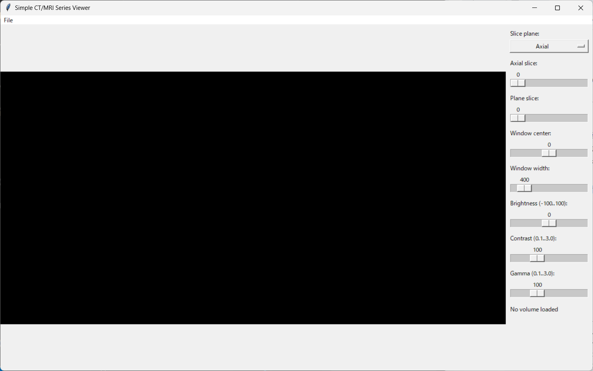
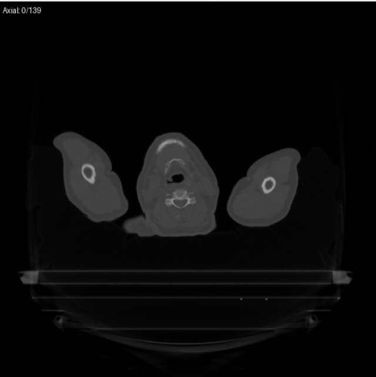
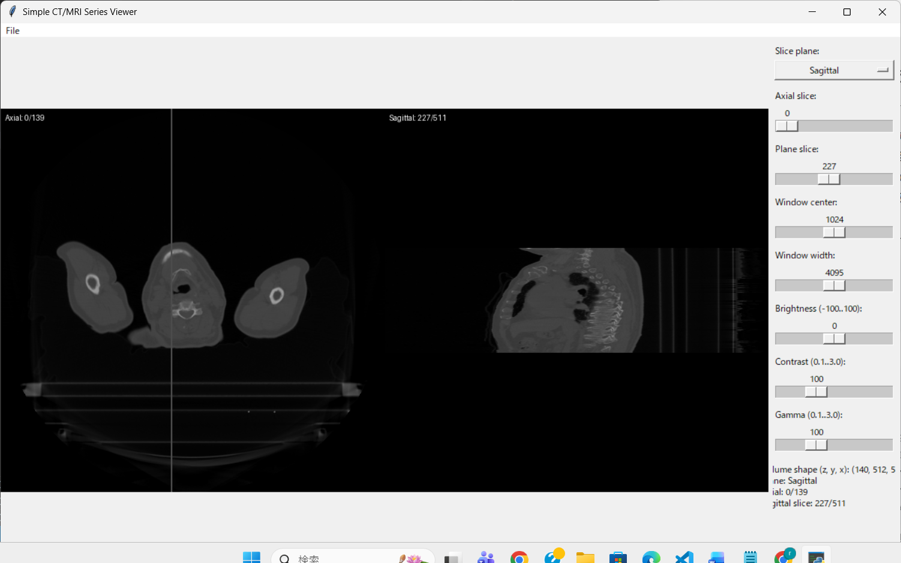
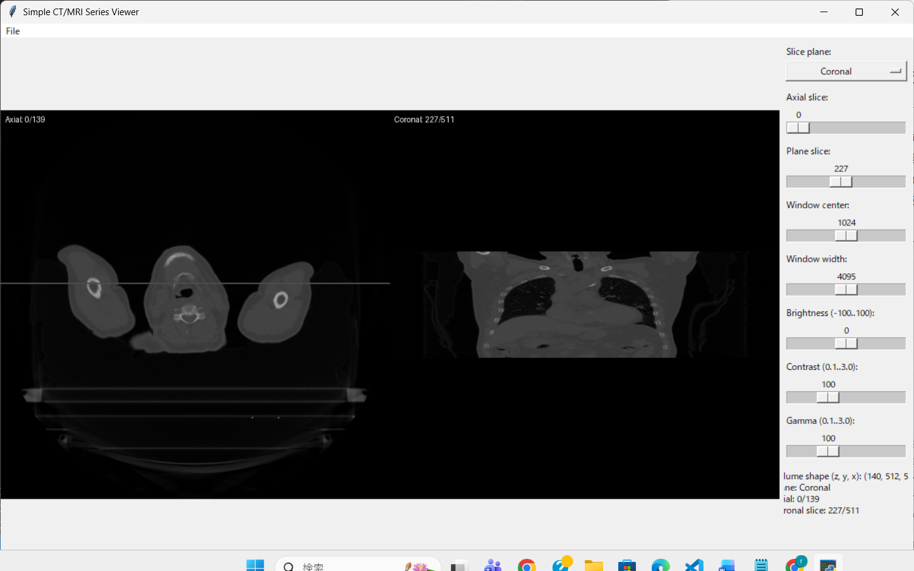
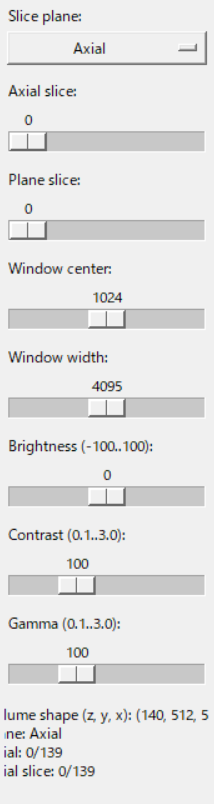

# Simple CT/MRI Series Viewer — 操作マニュアル（画像埋め込み版）

このマニュアルは予備知識の無いユーザーでも本アプリを操作できるよう、画面ごと／操作ごとにスクリーンショットを入れて手順を丁寧に示します。

※ 本マニュアルはプロジェクトの `images/` フォルダ内にあるスクリーンショット画像を参照します。

---

## 目次
1. 概要
2. 起動方法
3. 画面構成（スクリーンショット）
4. 基本操作（フォルダ読み込み・スライダ）
5. スライダの説明と効果（WW/WL/Brightness/Contrast/Gamma）
6. 具体的な操作例（スクショ付き）
7. トラブルシュート
8. ライセンス

---

## 1. 概要
本アプリはフォルダ内の DICOM（*.dcm）または画像スタック（PNG/JPG/TIFF 等）を読み込み、
- 左画面: 原画像系列（Axial）
- 右画面: 選択平面（Axial / Coronal / Sagittal）

を同時に表示します。Window Level（WC）/Window Width（WW）や Brightness / Contrast / Gamma をスライダで調整できます。

---

## 2. 起動方法
- 配布された `app.exe` をダブルクリックするだけで起動できます（推奨）。
- ソースから起動する場合（開発向け）:
  1. Python 3.7+ をインストール
  2. 必要なパッケージをインストール（開発者のみ）: `pip install -r requirements.txt`
  3. `python app.py` を実行

---

## 3. 画面構成（スクリーンショット）
アプリを起動してフォルダを読み込むと、次のような UI が表示されます。

**図 1: アプリ全体の UI**

図の説明:
- 左: Axial（原画像系列）
- 右: 選択平面（現在は Sagittal/Coronal など）
- 右側サイドバー: Plane 選択、Axial/Plane のスライダ、Window/Level などのコントロール

---

## 4. 基本操作（フォルダ読み込み・スライダ）
1. メニュー `File -> Open Folder...` をクリック
2. そのフォルダには同一シリーズの DICOM ファイル (*.dcm) がまとめて入っているか、同一サイズの画像群（PNG/JPG/TIFF）が入っていることを確認
3. フォルダを選択すると自動で読み込みます。読み込み完了後、右側の情報ラベルにボリュームサイズ（z, y, x）とスライスが表示されます。

スライダ:
- Axial slice: 左画面（Axial シリーズ）のスライスを切り替え
- Plane slice: 右画面（選択平面）のスライスを切り替え
- Window center / Window width: WL/WW を調整（下の節で詳細説明）
- Brightness / Contrast / Gamma: 見た目の調整

---

## 5. スライダの説明と効果
以下は各スライダが画像に与える影響と、どのように使うと見たい情報が見やすくなるかの説明です。

### Window center (WC)
- 説明: 画像表示の「中心」輝度（CT では HU の中心）を設定します。
- 効果: 値を上げると明るい構造が見えやすくなり、下げると暗い構造が見えやすくなります。
- 使い方: 軟部（WC 小）、骨（WC 大）など用途に応じて変更。

### Window width (WW)
- 説明: 輝度幅。小さいほどコントラストが高く（狭帯域）、大きいほどコントラストが低く（広帯域）。
- 効果: WW を狭くすると微細な差が強調されるが、飽和も起きやすい。
- 使い方: 軟部を細かく見たいときは WW を狭く。肺や骨を広く見たいときは WW を大きく。

### Brightness
- ピクセル値全体に加算されるオフセット（±100 程度）。画像全体が暗い/明るい場合の微調整に使用。

### Contrast
- ピクセル値に掛ける倍率（GUI 上は 0.1..3.0 の範囲）。1.0 が等倍。大きくすると明暗差が強調される。

### Gamma
- 中間値の強調に使う補正。1.0 がデフォルト。<1 で暗部が明るくなり、>1 で明部が強調される。

---

## 6. 具体的な操作例（スクリーンショット付き）

### 例 A: Axial（原画像）のクローズアップ

説明: 左画面が Axial です。右上の情報欄にスライス番号が表示されます（アプリ内でも確認可能）。

### 例 B: 右画面が Sagittal の状態（左画面に縦線オーバーレイ）

説明: 右画面が Sagittal（矢状面）を表示しているとき、左の Axial 上には現在の Sagittal 位置を示す縦線（白）が表示されます。

### 例 C: 右画面が Coronal の状態（左画面に横線オーバーレイ）

説明: 右画面が Coronal（冠状面）を表示しているとき、左の Axial 上には現在の Coronal 位置を示す横線（白）が表示されます。

### 例 D: スライダ周辺（Window/Level/その他）

説明: WC/WW のスライダや Brightness/Contrast/Gamma の位置を示したスクリーンショットです。これらを動かすと左右両方の表示に即時反映されます。

---

## 7. トラブルシュート
Q: 画像が読み込めない／エラーが出る
- A: DICOM 読み込みでエラーが出る場合は pydicom が必要（ただし配布済み exe なら不要）。画像スタックを選ぶ場合は同一サイズ・同一フォーマットの画像群を使用してください。

Q: オーバーレイ線がずれて見える
- A: 画像の元サイズと表示サイズ（512×512）に差があるとスケール誤差が生じます。可能であれば元画像を 512×512 へリサイズしてから読み込むか、表示サイズを調整してください。

---

## 8. ライセンス
このソフトウェアは

### このソフトで使用しているソフトウェア・外部ライブラリのライセンス
FULLのライセンスは[THIRD_PARTY_LICE_TEMP.md](THIRD_PARTY_LICE_TEMP.md)に記述しています
- Python © Python Software Foundation, licensed under the PSF License
- numpy    2.3.4    BSD License  https://numpy.org                   Fundamental package for array computing in Python
- pillow   12.0.0   MIT-CMU      https://python-pillow.github.io     Python Imaging Library (fork)               

- pydicom  3.0.1    MIT License  https://github.com/pydicom/pydicom  A pure Python package for reading and writing DICOM data